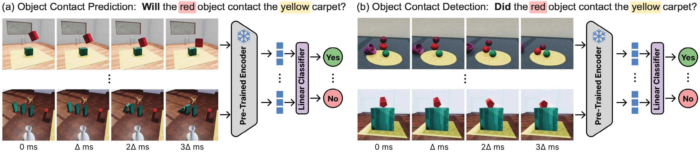

# Physion V1.5: A benchmark for evaluating Physical Prediction Models

This repository contains scripts for evaluating computer vision models on the Physion V1.5: https://physion-benchmark.github.io/. The benchmark evaluates intuitive physics understanding in physical prediction models using the tasks outlined below:  


<div style="display: flex; flex-wrap: wrap; justify-content: center; gap: 20px;">

  <div style="text-align: center;">
    
  </div>

</div>

  
[//]: # ()
[//]: # (</div>)

[//]: # ()
[//]: # (<div style="display: flex; flex-wrap: wrap; justify-content: center; gap: 20px;">)

[//]: # ()
[//]: # (  <div style="text-align: center;">)

[//]: # (    <b>Intuitive physics scenarios in Physion</b><br>)

[//]: # (    )

[//]: # (  </div>)

[//]: # ()
[//]: # (  )
[//]: # ()
[//]: # (</div>)


## Installation

To use this package, install it by running the following commands: 

```bash
git clone <repository_url>
cd physion_evaluator
pip install -e .
```

## Steps to evaluate a model on the Physion V1.5 benchmark

### 1. Download and unzip the dataset

Run the following command to download and unzip the Physion V1.5 dataset:

```bash
sh download_dataset.sh
```

This will download the dataset and extract it to the `local_path` specified in the script.

### 2. Implement the PhysionFeatureExtraction AbstractBaseClass

```python
class CustomFeatureExtractor(PhysionFeatureExtractor):

    def __init__(self, weights_path, model_name):
        super().__init__(weights_path, model_name)
        # Additional initialization if needed

    def transform(self):
        # Define transformations, frame gap, and minimum frames
        # Example: return torchvision transform_fn, frame_gap, num_frames
        pass

    def extract_features(self, videos):
        # Implement feature extraction logic
        # Example: return extracted_features
        pass

# Usage example
weights_path = '/path/to/model/weights.pth'
model = CustomFeatureExtractor(weights_path, 'test_model')
```

Note: This class can be written in the repository where the model is developed.

### Implementation Guide

To implement a feature extraction model using `PhysionFeatureExtractor`, follow these steps:

1. **Inheritance**:
   - Inherit from `PhysionFeatureExtractor` and implement the abstract methods `transform` and `extract_features`.

2. **Constructor** (`__init__`):
   - Define the constructor (`__init__`) to initialize the model with necessary parameters such as `weights_path` (path to model weights) and `model_name`.

3. **Abstract Methods**:
   - **`transform`**: Override this method to specify how input data (videos) should be transformed or preprocessed. It should return necessary transformations, frame gaps, and minimum frames required.
   - **`extract_features`**: Override this method to define how features are extracted from the input videos. The method should accept a tensor of videos (`[B, T, C, H, W]`) and return extracted features (`[B, T, D]`).

Reference implementations can be found in the physion models repo. 

### 3. Run feature extraction

```bash
physion_feature_extract \
--model_path <path to model checkpoint> \
--data_root_path <path to physion data> \
--model_class <python module path to feature extractor implementation> \
--gpu <gpu_index> \
--batch_size <batch_size> \
--dir_for_saving <path to dir for saving features> \
--mode <ocp/ocd>
```


| Argument            | Description                                            |
|---------------------|--------------------------------------------------------|
| `--model_path`      | Path to the pre-trained model checkpoint.              |
| `--data_root_path`  | Root directory containing physion dataset.             |
| `--model_class`     | Python module path for the feature extraction model.   |
| `--gpu`             | Index of the GPU to use.                               |
| `--batch_size`      | Batch size for feature extraction.                     |
| `--dir_for_saving`  | Directory to save extracted features and JSON metadata. |
| `--mode`            | Which physion task to evaluate (ocp/ocd).              |

### Example Usage

After implementing the PhysionFeatureExtractor base class in your model development repo (e.g. `/home/<user>/model_repo/extractor.py`) run the following command to extract features from the model:

```bash
cd /home/<user>/model_repo

physion_feature_extract \
--model_path /home/<user>/model_repo/ckpt.pth \
--data_root_path /home/<user>/physion_data/ \
--model_class extractor.CustomFeatureExtractor \
--gpu 0 \
--batch_size 8 \
--dir_for_saving /home/physion_features/model_repo \
--mode ocp
```


### 4. Run Evaluation

The `physion_feature_extract` command will save features and additional metadata in the path specified by the <dir_for_saving> argument. We can now evaluate the model on the benchmark by training a linear probe on the extracted features. 

```bash
physion_train_readout \
--train-path  <dir_for_saving>/<mode>/train_features.hdf5 \
--test-path <dir_for_saving>/<mode>/test_features.hdf5 \
--model-name <model_name> \
--train-scenario-indices <dir_for_saving>/<mode>/train_json.json \
--test-scenario-indices <dir_for_saving>/<mode>/test_json.json \
--test-scenario-map <dir_for_saving>/<mode>/test_scenario_map.json \
--save_path <dir_for_saving>
```

| Argument                   | Description                                                   |
|----------------------------|---------------------------------------------------------------|
| `--model-name`             | Name of the model being evaluated.                            |                  
| `--train-path`             | Path to the HDF5 file containing training data.               |
| `--test-path`              | Path to the HDF5 file containing test data.                   |
| `--train-scenario-indices` | Path to JSON file with training scenario indices.             |
| `--test-scenario-indices`  | Path to JSON file with test scenario indices.                 |
| `--test-scenario-map`      | Path to JSON file mapping test scenario indices to filenames. |
| `--save_path`              | Directory where evaluation results will be saved.             |


### Example Usage

```bash
cd /home/<user>/model_repo
physion_train_readout \
--train-path /home/physion_features/model_repo/ocp/train_features.hdf5 \
--test-path /home/physion_features/model_repo/ocp/test_features.hdf5 \
--model-name test_model \
--train-scenario-indices /home/physion_features/model_repo/ocp/train_json.json \
--test-scenario-indices /home/physion_features/model_repo/ocp/test_json.json \
--test-scenario-map /home/physion_features/model_repo/ocp/test_scenario_map.json \
--save_path /home/physion_features/model_repo
```


### Reference Implementations

Please refer to Physion models repo for a zoo of model implementations of `PhysionFeatureExtractor`. The repo also contains the commands required for feature extraction, linear probe training and evaluation.


